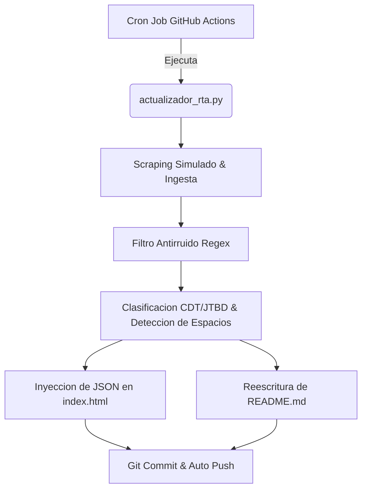

# Inteligencia de Canales Digitales de Muebles RTA

Ultima actualizacion semanal: 2026-07-15 | Analista Principal: Amelia RTA

Tendencia Dominante de Mercado: Design-Driven (Estetica & Estilos)
Total Alertas de Oportunidad (Espacios en Blanco): 4

## Resumen de Visualizaciones del Dashboard
- Matriz de Ciclo de Vida de Tendencias: Mapeo de categorias en fases de Introduccion, Crecimiento, Madurez o Declive.
- Trafico Digital vs. Presencia de Marca Propia: Comportamiento de penetracion de marca propia en relacion al volumen de trafico digital.

Para explorar las visualizaciones interactivas de Chart.js y aplicar filtros dinamicos, abre el archivo index.html en tu navegador.

---
## Analisis Detallado por Cliente (11 Canales)

### Sodimac
- **Pais:** Colombia | **Ciudades Cobertura:** Bogota, Medellin, Cali, Barranquilla, Cartagena
- **Peso Estimado de Marca Propia:** 44.7% | **Indice de Trafico Digital:** 92/100

#### Productos Mas Vendidos / Potenciados

#### Fuentes Futuras de Monitoreo Recomendadas

#### Arquitectura y Jerarquia del Menu (Filtrado sin Ruido)

#### Arbol de Decision de Compra (CDT) Digital
- Enfoque Principal: Técnico/Precio

#### Set Competitivo Principal
- 

#### Perfil Buyer Persona (Jobs-To-Be-Done)
- Arquetipo: Remodelador Practico JtBD
- Job y Sugerencia Pitch: Detectamos que el interes por muebles click armar crecio. Te proponemos nuestra linea...

#### Alertas de Espacio en Blanco (Oportunidades de Catalogo)
- ALERTA: Deficit en sistemas de ensamble rapido (herrajes Click o Minifix).

---

### Home Depot MX
- **Pais:** México | **Ciudades Cobertura:** Ciudad de México, Monterrey, Guadalajara, Veracruz, Mérida
- **Peso Estimado de Marca Propia:** 29.7% | **Indice de Trafico Digital:** 90/100

#### Productos Mas Vendidos / Potenciados

#### Fuentes Futuras de Monitoreo Recomendadas

#### Arquitectura y Jerarquia del Menu (Filtrado sin Ruido)

#### Arbol de Decision de Compra (CDT) Digital
- Enfoque Principal: Técnico/Precio

#### Set Competitivo Principal
- 

#### Perfil Buyer Persona (Jobs-To-Be-Done)
- Arquetipo: Contratista / Dueño de Casa DIY
- Job y Sugerencia Pitch: Detectamos que el interes por muebles de cocina crecio. Te proponemos nuestra linea...

#### Alertas de Espacio en Blanco (Oportunidades de Catalogo)
- No se detectan alertas criticas en stock de tableros RH o ensamble rapido.

---

### Leroy Merlin
- **Pais:** España | **Ciudades Cobertura:** Madrid, Barcelona, Valencia, Sevilla
- **Peso Estimado de Marca Propia:** 35% | **Indice de Trafico Digital:** 87/100

#### Productos Mas Vendidos / Potenciados

#### Fuentes Futuras de Monitoreo Recomendadas

#### Arquitectura y Jerarquia del Menu (Filtrado sin Ruido)

#### Arbol de Decision de Compra (CDT) Digital
- Enfoque Principal: Técnico/Precio

#### Set Competitivo Principal
- 

#### Perfil Buyer Persona (Jobs-To-Be-Done)
- Arquetipo: Reformador DIY Español
- Job y Sugerencia Pitch: Detectamos que el interes por muebles de cocina crecio. Te proponemos nuestra linea...

#### Alertas de Espacio en Blanco (Oportunidades de Catalogo)
- No se detectan alertas criticas en stock de tableros RH o ensamble rapido.

---

### Virtual Muebles
- **Pais:** Colombia | **Ciudades Cobertura:** Medellin, Bogota, Envigado
- **Peso Estimado de Marca Propia:** 90.5% | **Indice de Trafico Digital:** 79/100

#### Productos Mas Vendidos / Potenciados

#### Fuentes Futuras de Monitoreo Recomendadas

#### Arquitectura y Jerarquia del Menu (Filtrado sin Ruido)

#### Arbol de Decision de Compra (CDT) Digital
- Enfoque Principal: Estética/Estilo

#### Set Competitivo Principal
- 

#### Perfil Buyer Persona (Jobs-To-Be-Done)
- Arquetipo: Comprador Digital Joven JtBD
- Job y Sugerencia Pitch: Detectamos que el interes por muebles de cocina crecio. Te proponemos nuestra linea...

#### Alertas de Espacio en Blanco (Oportunidades de Catalogo)
- No se detectan alertas criticas en stock de tableros RH o ensamble rapido.

---

### Cencosud
- **Pais:** Colombia | **Ciudades Cobertura:** Bogota, Medellin, Cali
- **Peso Estimado de Marca Propia:** 29.3% | **Indice de Trafico Digital:** 89/100

#### Productos Mas Vendidos / Potenciados

#### Fuentes Futuras de Monitoreo Recomendadas

#### Arquitectura y Jerarquia del Menu (Filtrado sin Ruido)

#### Arbol de Decision de Compra (CDT) Digital
- Enfoque Principal: Estética/Estilo

#### Set Competitivo Principal
- 

#### Perfil Buyer Persona (Jobs-To-Be-Done)
- Arquetipo: Comprador de Hogar de Clase Media
- Job y Sugerencia Pitch: Detectamos que el interes por muebles de cocina rh crecio. Te proponemos nuestra linea...

#### Alertas de Espacio en Blanco (Oportunidades de Catalogo)
- ALERTA: Deficit de portafolio hidrofugo (RH) en el catalogo.
- ALERTA: Deficit en sistemas de ensamble rapido (herrajes Click o Minifix).

---

### Sodimac Chile
- **Pais:** Chile | **Ciudades Cobertura:** Santiago, Concepcion, Valparaiso, Antofagasta
- **Peso Estimado de Marca Propia:** 39.5% | **Indice de Trafico Digital:** 84/100

#### Productos Mas Vendidos / Potenciados

#### Fuentes Futuras de Monitoreo Recomendadas

#### Arquitectura y Jerarquia del Menu (Filtrado sin Ruido)

#### Arbol de Decision de Compra (CDT) Digital
- Enfoque Principal: Técnico/Precio

#### Set Competitivo Principal
- 

#### Perfil Buyer Persona (Jobs-To-Be-Done)
- Arquetipo: Hogares en Crecimiento
- Job y Sugerencia Pitch: Detectamos que el interes por muebles de cocina rh crecio. Te proponemos nuestra linea...

#### Alertas de Espacio en Blanco (Oportunidades de Catalogo)
- ALERTA: Deficit de portafolio hidrofugo (RH) en el catalogo.
- ALERTA: Alto riesgo de churn comercial en zonas costeras por falta de material adecuado para humedad severa.

---

### Wayfair
- **Pais:** USA | **Ciudades Cobertura:** Miami, Los Ángeles, Nueva York
- **Peso Estimado de Marca Propia:** 15.7% | **Indice de Trafico Digital:** 96/100

#### Productos Mas Vendidos / Potenciados

#### Fuentes Futuras de Monitoreo Recomendadas

#### Arquitectura y Jerarquia del Menu (Filtrado sin Ruido)

#### Arbol de Decision de Compra (CDT) Digital
- Enfoque Principal: Técnico/Precio

#### Set Competitivo Principal
- 

#### Perfil Buyer Persona (Jobs-To-Be-Done)
- Arquetipo: Young Urban Professional
- Job y Sugerencia Pitch: Detectamos que el interes por muebles de cocina crecio. Te proponemos nuestra linea...

#### Alertas de Espacio en Blanco (Oportunidades de Catalogo)
- No se detectan alertas criticas en stock de tableros RH o ensamble rapido.

---

### Promart
- **Pais:** Perú | **Ciudades Cobertura:** Lima, Arequipa, Trujillo, Chiclayo
- **Peso Estimado de Marca Propia:** 40.4% | **Indice de Trafico Digital:** 83/100

#### Productos Mas Vendidos / Potenciados

#### Fuentes Futuras de Monitoreo Recomendadas

#### Arquitectura y Jerarquia del Menu (Filtrado sin Ruido)

#### Arbol de Decision de Compra (CDT) Digital
- Enfoque Principal: Técnico/Precio

#### Set Competitivo Principal
- 

#### Perfil Buyer Persona (Jobs-To-Be-Done)
- Arquetipo: Comprador Urbano Limeño
- Job y Sugerencia Pitch: Detectamos que el interes por muebles de cocina crecio. Te proponemos nuestra linea...

#### Alertas de Espacio en Blanco (Oportunidades de Catalogo)
- No se detectan alertas criticas en stock de tableros RH o ensamble rapido.

---

### TuHome
- **Pais:** Chile | **Ciudades Cobertura:** Santiago, Concepcion, Valparaiso, Antofagasta
- **Peso Estimado de Marca Propia:** 95.3% | **Indice de Trafico Digital:** 79/100

#### Productos Mas Vendidos / Potenciados

#### Fuentes Futuras de Monitoreo Recomendadas

#### Arquitectura y Jerarquia del Menu (Filtrado sin Ruido)

#### Arbol de Decision de Compra (CDT) Digital
- Enfoque Principal: Técnico/Precio

#### Set Competitivo Principal
- 

#### Perfil Buyer Persona (Jobs-To-Be-Done)
- Arquetipo: Hogares en Crecimiento
- Job y Sugerencia Pitch: Detectamos que el interes por muebles de cocina crecio. Te proponemos nuestra linea...

#### Alertas de Espacio en Blanco (Oportunidades de Catalogo)
- No se detectan alertas criticas en stock de tableros RH o ensamble rapido.

---

### Corona
- **Pais:** Colombia | **Ciudades Cobertura:** Bogota, Medellin, Cali, Barranquilla
- **Peso Estimado de Marca Propia:** 35.9% | **Indice de Trafico Digital:** 85/100

#### Productos Mas Vendidos / Potenciados

#### Fuentes Futuras de Monitoreo Recomendadas

#### Arquitectura y Jerarquia del Menu (Filtrado sin Ruido)

#### Arbol de Decision de Compra (CDT) Digital
- Enfoque Principal: Técnico/Precio

#### Set Competitivo Principal
- 

#### Perfil Buyer Persona (Jobs-To-Be-Done)
- Arquetipo: Maestro Especialista / Instalador
- Job y Sugerencia Pitch: Detectamos que el interes por muebles click armar crecio. Te proponemos nuestra linea...

#### Alertas de Espacio en Blanco (Oportunidades de Catalogo)
- ALERTA: Deficit en sistemas de ensamble rapido (herrajes Click o Minifix).

---

### Leroy Espejo
- **Pais:** España | **Ciudades Cobertura:** Madrid, Barcelona, Valencia, Sevilla
- **Peso Estimado de Marca Propia:** 30.3% | **Indice de Trafico Digital:** 81/100

#### Productos Mas Vendidos / Potenciados

#### Fuentes Futuras de Monitoreo Recomendadas

#### Arquitectura y Jerarquia del Menu (Filtrado sin Ruido)

#### Arbol de Decision de Compra (CDT) Digital
- Enfoque Principal: Técnico/Precio

#### Set Competitivo Principal
- 

#### Perfil Buyer Persona (Jobs-To-Be-Done)
- Arquetipo: Reformador DIY Español
- Job y Sugerencia Pitch: Detectamos que el interes por muebles de cocina crecio. Te proponemos nuestra linea...

#### Alertas de Espacio en Blanco (Oportunidades de Catalogo)
- No se detectan alertas criticas en stock de tableros RH o ensamble rapido.

---

## Arquitectura del Ecosistema Predictivo
Este repositorio se actualiza autonomamente cada lunes a las 00:00 UTC.

