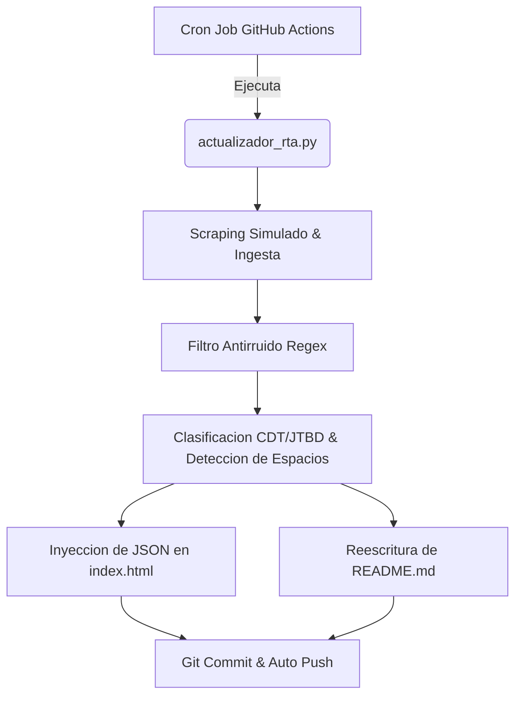

# Inteligencia de Canales Digitales de Muebles RTA

Ultima actualizacion semanal: 2026-07-09 | Analista Principal: Amelia RTA

Tendencia Dominante de Mercado: 
Total Alertas de Oportunidad (Espacios en Blanco): 

## Resumen de Visualizaciones del Dashboard
- Matriz de Ciclo de Vida de Tendencias: Mapeo de categorias en fases de Introduccion, Crecimiento, Madurez o Declive.
- Trafico Digital vs. Presencia de Marca Propia: Comportamiento de penetracion de marca propia en relacion al volumen de trafico digital.

Para explorar las visualizaciones interactivas de Chart.js y aplicar filtros dinamicos, abre el archivo index.html en tu navegador.

---
## Analisis Detallado por Cliente (11 Canales)

## Arquitectura del Sistema de Automatizacion
Este repositorio se actualiza autonomamente cada lunes a las 00:00 UTC.

<!-- Rebuild Trigger: 2026-07-09T08:30:00 -->
