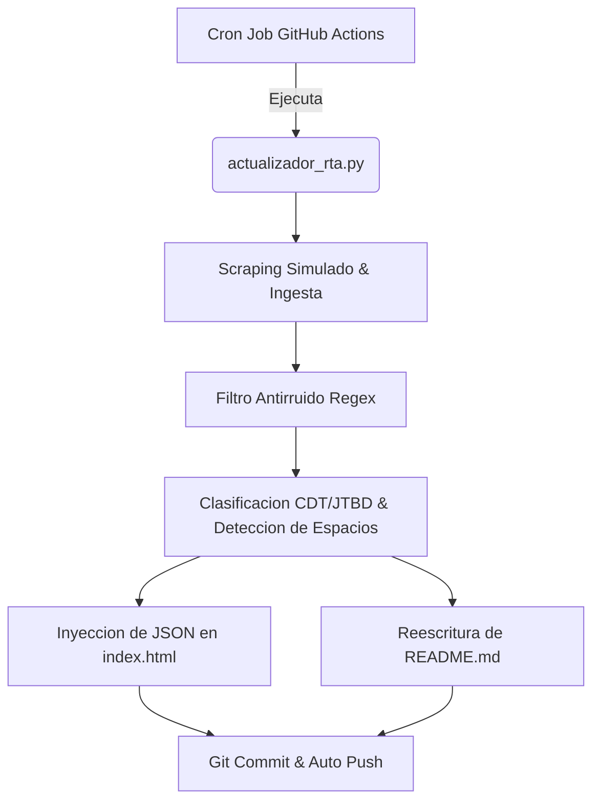

# Inteligencia de Canales Digitales de Muebles RTA

Ultima actualizacion semanal: 2026-06-12 | Analista Principal: Amelia RTA

Tendencia Dominante de Mercado: Benefit-Driven (RH & Ensamble)
Total Alertas de Oportunidad (Espacios en Blanco): 8

## Resumen de Visualizaciones del Dashboard
- Matriz de Ciclo de Vida de Tendencias: Mapeo de categorias en fases de Introduccion, Crecimiento, Madurez o Declive.
- Trafico Digital vs. Presencia de Marca Propia: Comportamiento de penetracion de marca propia en relacion al volumen de trafico digital.

Para explorar las visualizaciones interactivas de Chart.js y aplicar filtros dinamicos, abre el archivo index.html en tu navegador.

---
## Analisis Detallado por Cliente (11 Canales)

### SODIMAC COLOMBIA S.A
- **Pais:** Colombia | **Ciudades Cobertura:** Bogota, Medellin, Cali, Barranquilla
- **Peso Estimado de Marca Propia:** 44.8% | **Indice de Trafico Digital:** 89/100

#### Productos Mas Vendidos / Potenciados
- Modulo Fregadero MDP-RH 100cm
- Escritorio Home Office Smart 120cm
- Estanterias RTA Metalicas

#### Fuentes Futuras de Monitoreo Recomendadas
- MercadoLibre Colombia (Tendencias de Busqueda)
- Homecenter Chile (Benchmark de Clones de Diseno)
- Google Analytics RTA (Tasa de rebote en categoria de cocinas modulares y descargas de instructivos de armado)

#### Arquitectura y Jerarquia del Menu (Filtrado sin Ruido)
- Muebles de Cocina - Modulares
- Muebles de TV y Centros de Entretenimiento
- Estanterias y Closets RTA
- Muebles de Bano RH Resistentes a Humedad

#### Arbol de Decision de Compra (CDT) Digital
- Enfoque Principal: Benefit/Price-Driven (Atributos Tecnicos & Funcionalidad)
  - 1. Dimensiones y espacio disponible (Filtro numerico)
  - 2. Resistencia del material (Aglomerado estandar vs Tablero RH)
  - 3. Relacion precio-capacidad de almacenado

#### Set Competitivo Principal
- Cencosud, Almacenes Exito, Corona

#### Perfil Buyer Persona (Jobs-To-Be-Done)
- Arquetipo: Remodelador Practico
- Trabajo a Realizar (Job): Optimizar el espacio de la cocina y zona de ropas de forma rapida y sin herramientas complejas.
- Puntos de Dolor (Pains): Aglomerados que se inflan con humedad, herrajes faltantes y manuales de ensamble confusos.
- Disparador de Compra (Trigger): Renovacion de arriendo o mudanza a departamento nuevo de interes social (VIS).

#### Alertas de Espacio en Blanco (Oportunidades de Catalogo)
- No se detectan alertas criticas en stock de tableros RH o ensamble rapido.

---

### NOVAVENTA S.A.S
- **Pais:** Colombia | **Ciudades Cobertura:** Medellin, Bogota, Bucaramanga, Cali
- **Peso Estimado de Marca Propia:** 16.1% | **Indice de Trafico Digital:** 73/100

#### Productos Mas Vendidos / Potenciados
- Mueble Zapatero RTA 12 Pares
- Escritorio Plegable Practico
- Organizador Microondas con Canastillas

#### Fuentes Futuras de Monitoreo Recomendadas
- Novaventa App (Encuestas Directas a Mamas Empresarias)
- Leonisa/Catalogo Hogar (Analisis de Surtido Competidor)
- Google Analytics RTA (Interacciones en catalogo interactivo y clics de pedido rapido de zapateros)

#### Arquitectura y Jerarquia del Menu (Filtrado sin Ruido)
- Muebles Practicos del Catálogo Novaventa
- Organizadores de Cocina Practicos

#### Arbol de Decision de Compra (CDT) Digital
- Enfoque Principal: Benefit/Price-Driven (Atributos Tecnicos & Funcionalidad)
  - 1. Dimensiones y espacio disponible (Filtro numerico)
  - 2. Resistencia del material (Aglomerado estandar vs Tablero RH)
  - 3. Relacion precio-capacidad de almacenado

#### Set Competitivo Principal
- Almacenes Exito, Virtual Muebles, Mobbly

#### Perfil Buyer Persona (Jobs-To-Be-Done)
- Arquetipo: Mama Empresaria / Vendedora por Catalogo
- Trabajo a Realizar (Job): Ofrecer a sus vecinos de confianza muebles RTA practicos y de bajo costo que paguen a plazos comodos.
- Puntos de Dolor (Pains): Complicacion en el ensamble post-venta, cajas muy pesadas para transportar, cobros dificiles si el mueble falla.
- Disparador de Compra (Trigger): Oportunidades de catalogo mensual para aumentar ingresos extras.

#### Alertas de Espacio en Blanco (Oportunidades de Catalogo)
- ALERTA: Escasez de portafolio hidrofugo (RH) en zonas humedas. Solo el 0% de los muebles de cocina/bano cuentan con propiedades hidrofugas.

---

### INVERSIONES VIRTUAL MUEBLES S.A.S
- **Pais:** Colombia | **Ciudades Cobertura:** Medellin, Bogota, Envigado
- **Peso Estimado de Marca Propia:** 88.5% | **Indice de Trafico Digital:** 76/100

#### Productos Mas Vendidos / Potenciados
- Centro de TV Nordico Blanco-Roble
- Escritorio Gamer Pro
- Escritorio Plegable Work-Space

#### Fuentes Futuras de Monitoreo Recomendadas
- Amazon Global (Tendencias de Diseno Industrial)
- Instagram Shopping (Engagement de Muebles RTA)
- Google Analytics RTA (Embudo de conversion de la linea Gamer y rebote en landings de escritorio flexible)

#### Arquitectura y Jerarquia del Menu (Filtrado sin Ruido)
- Salas y Centros de TV Design
- Escritorios Flexibles Modernos
- Zapateros y Armarios Multifuncion

#### Arbol de Decision de Compra (CDT) Digital
- Enfoque Principal: Design-Driven (Estetica, Acabados & Estilo de Vida)
  - 1. Combinacion de colores y estilo estetico (Nordico, Wengue, Industrial)
  - 2. Tipo de ensamble visual (Flotante, de patas de madera)
  - 3. Calificaciones de diseno y reviews en web

#### Set Competitivo Principal
- TuHome, Mobbly, Novaventa

#### Perfil Buyer Persona (Jobs-To-Be-Done)
- Arquetipo: Comprador Digital Joven
- Trabajo a Realizar (Job): Amoblar su primer apartamento con disenos atractivos que se puedan comprar 100% en linea y recibir rapido.
- Puntos de Dolor (Pains): Dificultad de envio, falta de soporte para piezas danadas en transporte, desconfianza en fotos web.
- Disparador de Compra (Trigger): Primer empleo profesional, independencia de casa de los padres.

#### Alertas de Espacio en Blanco (Oportunidades de Catalogo)
- No se detectan alertas criticas en stock de tableros RH o ensamble rapido.

---

### TUHOME SPA
- **Pais:** Chile | **Ciudades Cobertura:** Santiago, Concepcion, Valparaiso, Antofagasta
- **Peso Estimado de Marca Propia:** 96.1% | **Indice de Trafico Digital:** 79/100

#### Productos Mas Vendidos / Potenciados
- Escritorio Home Office Z-60 Nogal
- Mueble Lavamanos Split RH
- Closet RTA 4 Puertas Wengue

#### Fuentes Futuras de Monitoreo Recomendadas
- Falabella.com Chile (Surtido y Quiebres de Stock)
- MercadoLibre Chile (Palabras clave de Muebles)
- Google Analytics RTA (Porcentaje de abandono del checkout B2B y telemetria de visualizacion de closets)

#### Arquitectura y Jerarquia del Menu (Filtrado sin Ruido)
- Coleccion Cocina y Despensa Modulares
- Centros de Entretenimiento Modernos
- Linea Oficina y Escritorios RTA
- Muebles Auxiliares de Bano
- Novedades Diseno Industrial RTA

#### Arbol de Decision de Compra (CDT) Digital
- Enfoque Principal: Benefit/Price-Driven (Atributos Tecnicos & Funcionalidad)
  - 1. Dimensiones y espacio disponible (Filtro numerico)
  - 2. Resistencia del material (Aglomerado estandar vs Tablero RH)
  - 3. Relacion precio-capacidad de almacenado

#### Set Competitivo Principal
- Virtual Muebles, Mobbly, Cencosud

#### Perfil Buyer Persona (Jobs-To-Be-Done)
- Arquetipo: Hogares en Crecimiento
- Trabajo a Realizar (Job): Adaptar el mobiliario del hogar segun el crecimiento de los hijos con soluciones modulares y escalables.
- Puntos de Dolor (Pains): Muebles pesados dificiles de mover, poca variedad en tonos de madera real, ensamble que requiere 2 personas.
- Disparador de Compra (Trigger): Llegada de un nuevo hijo o reorganizacion de dormitorios.

#### Alertas de Espacio en Blanco (Oportunidades de Catalogo)
- No se detectan alertas criticas en stock de tableros RH o ensamble rapido.

---

### FERRETERIA EPA
- **Pais:** Venezuela | **Ciudades Cobertura:** Caracas, Valencia, Maracaibo, Barquisimeto
- **Peso Estimado de Marca Propia:** 29.7% | **Indice de Trafico Digital:** 72/100

#### Productos Mas Vendidos / Potenciados
- Gabinete Auxiliar de Planchado MDP
- Escritorio Estudiante Basic Gris
- Modulo Cocina Fregadero 120cm

#### Fuentes Futuras de Monitoreo Recomendadas
- MercadoLibre Venezuela (Demanda de Muebles RTA de Bajo Costo)
- EPA Costa Rica/El Salvador (Benchmarking de Precios RTA)
- Google Analytics RTA (Tasa de conversion en el configurador de muebles modulares de cocina)

#### Arquitectura y Jerarquia del Menu (Filtrado sin Ruido)
- Muebles Modulares para Cocina
- Escritorios RTA Practicos
- Linea de Organizadores Economicos
- Muebles de Bano Basicos

#### Arbol de Decision de Compra (CDT) Digital
- Enfoque Principal: Benefit/Price-Driven (Atributos Tecnicos & Funcionalidad)
  - 1. Dimensiones y espacio disponible (Filtro numerico)
  - 2. Resistencia del material (Aglomerado estandar vs Tablero RH)
  - 3. Relacion precio-capacidad de almacenado

#### Set Competitivo Principal
- Sodimac, Novey, Cencosud

#### Perfil Buyer Persona (Jobs-To-Be-Done)
- Arquetipo: Auto-constructor RTA
- Trabajo a Realizar (Job): Hacer mejoras funcionales en el hogar los fines de semana de forma economica.
- Puntos de Dolor (Pains): Falta de herramientas de ensamble en casa, tornilleria incompleta en el empaque original.
- Disparador de Compra (Trigger): Proyecto DIY (Hagalo usted mismo) de fin de semana.

#### Alertas de Espacio en Blanco (Oportunidades de Catalogo)
- ALERTA: Escasez de portafolio hidrofugo (RH) en zonas humedas. Solo el 0% de los muebles de cocina/bano cuentan con propiedades hidrofugas.
- ALERTA: Deficit en sistemas de ensamble rapido (Minifix o Click). El catalogo aun depende en un 100% de tornilleria tradicional compleja.

---

### CENCOSUD COLOMBIA SA
- **Pais:** Colombia | **Ciudades Cobertura:** Bogota, Medellin, Cali, Barranquilla
- **Peso Estimado de Marca Propia:** 28.9% | **Indice de Trafico Digital:** 86/100

#### Productos Mas Vendidos / Potenciados
- Centro de TV Florencia Wengue
- Escritorio L-Shape Industrial Easy
- Modulo Cocina Aéreo Easy 100cm

#### Fuentes Futuras de Monitoreo Recomendadas
- Easy Argentina/Chile (Surtido de Muebles RTA Krea)
- MercadoLibre Colombia (Precios de Centros de TV)
- Google Analytics RTA (Busqueda interna de centros de TV y tasa de abandono en carritos de muebles de sala)

#### Arquitectura y Jerarquia del Menu (Filtrado sin Ruido)
- Centros de TV y Entretenimiento Easy
- Escritorios y Sillas de Oficina
- Muebles de Cocina y Comedor RTA

#### Arbol de Decision de Compra (CDT) Digital
- Enfoque Principal: Design-Driven (Estetica, Acabados & Estilo de Vida)
  - 1. Combinacion de colores y estilo estetico (Nordico, Wengue, Industrial)
  - 2. Tipo de ensamble visual (Flotante, de patas de madera)
  - 3. Calificaciones de diseno y reviews en web

#### Set Competitivo Principal
- Sodimac, Almacenes Exito, Corona

#### Perfil Buyer Persona (Jobs-To-Be-Done)
- Arquetipo: Comprador de Hogar de Clase Media
- Trabajo a Realizar (Job): Encontrar un mueble de sala o estudio de buena apariencia que encaje exactamente en la sala de su apartamento sin gastar una fortuna.
- Puntos de Dolor (Pains): Falta de informacion clara sobre dimensiones en la web, retrasos en el despacho a domicilio.
- Disparador de Compra (Trigger): Remodelacion de la sala para recibir visitas de fin de ano.

#### Alertas de Espacio en Blanco (Oportunidades de Catalogo)
- ALERTA: Escasez de portafolio hidrofugo (RH) en zonas humedas. Solo el 0% de los muebles de cocina/bano cuentan con propiedades hidrofugas.
- ALERTA: Deficit en sistemas de ensamble rapido (Minifix o Click). El catalogo aun depende en un 100% de tornilleria tradicional compleja.

---

### MOBBLY S.A.S
- **Pais:** Colombia | **Ciudades Cobertura:** Bogota, Medellin, Cali
- **Peso Estimado de Marca Propia:** 80% | **Indice de Trafico Digital:** 64/100

#### Productos Mas Vendidos / Potenciados
- Escritorio Gamer Pro con Luces LED
- Mesa de TV Flotante 140cm
- Biblioteca Modular 5 Niveles

#### Fuentes Futuras de Monitoreo Recomendadas
- Pinterest Latam (Busquedas de Muebles Juveniles)
- TikTok Shopping (Conversion RTA en Audiencia Joven)
- Google Analytics RTA (Engagement en paginas de producto con visualizacion interactiva de centros de TV)

#### Arquitectura y Jerarquia del Menu (Filtrado sin Ruido)
- Escritorios Gamer y Home Office RTA
- Estanterias Modulares Libres de Ruido
- Mesas de TV y Centros de Diseno

#### Arbol de Decision de Compra (CDT) Digital
- Enfoque Principal: Design-Driven (Estetica, Acabados & Estilo de Vida)
  - 1. Combinacion de colores y estilo estetico (Nordico, Wengue, Industrial)
  - 2. Tipo de ensamble visual (Flotante, de patas de madera)
  - 3. Calificaciones de diseno y reviews en web

#### Set Competitivo Principal
- Virtual Muebles, TuHome, Novaventa

#### Perfil Buyer Persona (Jobs-To-Be-Done)
- Arquetipo: Estudiante o Joven Profesional
- Trabajo a Realizar (Job): Montar un espacio de estudio o trabajo estetico y ergonomico con un presupuesto muy ajustado.
- Puntos de Dolor (Pains): Escritorios inestables, acabados que se rayan con facilidad, falta de espacio para cables.
- Disparador de Compra (Trigger): Inicio de semestre universitario o transicion a trabajo remoto.

#### Alertas de Espacio en Blanco (Oportunidades de Catalogo)
- No se detectan alertas criticas en stock de tableros RH o ensamble rapido.

---

### CORPORACION FAVORITA C.A.
- **Pais:** Ecuador | **Ciudades Cobertura:** Quito, Guayaquil, Cuenca, Manta
- **Peso Estimado de Marca Propia:** 20.8% | **Indice de Trafico Digital:** 83/100

#### Productos Mas Vendidos / Potenciados
- Aparador Buffet Nordico 150cm
- Centro de Entretenimiento Rovere
- Mueble de Bano Suspendido Zen RH

#### Fuentes Futuras de Monitoreo Recomendadas
- Sukasa Online (Tendencias de Muebles de Alta Gama)
- MercadoLibre Ecuador (Precios de Muebles RTA de Comedor)
- Google Analytics RTA (Telemetria de la linea premium y clics en el boton de contacto para proyectos de sala)

#### Arquitectura y Jerarquia del Menu (Filtrado sin Ruido)
- Muebles RTA de Diseno Exclusivo Sukasa
- Aparadores y Centros de TV Modernos
- Muebles Organizadores de Lujo

#### Arbol de Decision de Compra (CDT) Digital
- Enfoque Principal: Design-Driven (Estetica, Acabados & Estilo de Vida)
  - 1. Combinacion de colores y estilo estetico (Nordico, Wengue, Industrial)
  - 2. Tipo de ensamble visual (Flotante, de patas de madera)
  - 3. Calificaciones de diseno y reviews en web

#### Set Competitivo Principal
- Novey, TuHome, Sodimac

#### Perfil Buyer Persona (Jobs-To-Be-Done)
- Arquetipo: Hogar Moderno Ecuatoriano
- Trabajo a Realizar (Job): Modernizar el comedor y la sala de estar con acabados elegantes y duraderos sin recurrir a carpinteros tradicionales.
- Puntos de Dolor (Pains): Poca oferta de disenos modernos en mercados locales, altos costos de importacion de muebles listos.
- Disparador de Compra (Trigger): Fiestas locales o mudanza de fin de ano.

#### Alertas de Espacio en Blanco (Oportunidades de Catalogo)
- No se detectan alertas criticas en stock de tableros RH o ensamble rapido.

---

### ALMACENES EXITO S.A.
- **Pais:** Colombia | **Ciudades Cobertura:** Medellin, Bogota, Cali, Barranquilla
- **Peso Estimado de Marca Propia:** 23.8% | **Indice de Trafico Digital:** 92/100

#### Productos Mas Vendidos / Potenciados
- Closet RTA 3 Puertas Finlandek
- Escritorio Compacto Office Finlandek
- Gabinete Cocina Auxiliar con Ruedas

#### Fuentes Futuras de Monitoreo Recomendadas
- Grupo Exito Marketplace (Conversion de Canje de Puntos)
- Carrefour Brasil (Modelos RTA de Alta Frecuencia)
- Google Analytics RTA (Trafico derivado a la categoria de dormitorio infantil y tasa de descarga de planos RTA)

#### Arquitectura y Jerarquia del Menu (Filtrado sin Ruido)
- Muebles de Dormitorio y Closets RTA
- Escritorios Finlandia Finlandek
- Muebles Auxiliares de Cocina y Bano

#### Arbol de Decision de Compra (CDT) Digital
- Enfoque Principal: Benefit/Price-Driven (Atributos Tecnicos & Funcionalidad)
  - 1. Dimensiones y espacio disponible (Filtro numerico)
  - 2. Resistencia del material (Aglomerado estandar vs Tablero RH)
  - 3. Relacion precio-capacidad de almacenado

#### Set Competitivo Principal
- Cencosud, Sodimac, Novaventa

#### Perfil Buyer Persona (Jobs-To-Be-Done)
- Arquetipo: Madre de Familia / Administradora del Hogar
- Trabajo a Realizar (Job): Comprar muebles para organizar los cuartos de los ninos aprovechando puntos de lealtad y promociones de supermercado.
- Puntos de Dolor (Pains): Dificultad para coordinar la entrega con el mercado semanal, calidad inconsistente en productos importados.
- Disparador de Compra (Trigger): Ofertas de fin de mes o acumulacion de puntos de fidelidad.

#### Alertas de Espacio en Blanco (Oportunidades de Catalogo)
- ALERTA: Escasez de portafolio hidrofugo (RH) en zonas humedas. Solo el 0% de los muebles de cocina/bano cuentan con propiedades hidrofugas.
- ALERTA: Deficit en sistemas de ensamble rapido (Minifix o Click). El catalogo aun depende en un 100% de tornilleria tradicional compleja.

---

### GEO F. NOVEY S.A.
- **Pais:** Panama | **Ciudades Cobertura:** Ciudad de Panama, David, Chitre, Colon
- **Peso Estimado de Marca Propia:** 36.3% | **Indice de Trafico Digital:** 75/100

#### Productos Mas Vendidos / Potenciados
- Modulo Fregadero RH Novey 120cm
- Gabinete Espejo de Bano RH
- Escritorio Home Office Basic Rovere

#### Fuentes Futuras de Monitoreo Recomendadas
- Novey.com.pa (Analytics de Busqueda de Productos Hidrofugos)
- Amazon EE.UU. (Importacion de Accesorios RTA a Panama)
- Google Analytics RTA (Trafico en fichas tecnicas de gabinetes de bano RH y descargas de guias de resistencia)

#### Arquitectura y Jerarquia del Menu (Filtrado sin Ruido)
- Muebles de Cocina Modular Novey
- Muebles de Bano RH Hidrofugos
- Escritorios RTA de Alta Resistencia

#### Arbol de Decision de Compra (CDT) Digital
- Enfoque Principal: Benefit/Price-Driven (Atributos Tecnicos & Funcionalidad)
  - 1. Dimensiones y espacio disponible (Filtro numerico)
  - 2. Resistencia del material (Aglomerado estandar vs Tablero RH)
  - 3. Relacion precio-capacidad de almacenado

#### Set Competitivo Principal
- Favorita, Sodimac, Ferreteria EPA

#### Perfil Buyer Persona (Jobs-To-Be-Done)
- Arquetipo: Propietario / Arrendador
- Trabajo a Realizar (Job): Amoblar de forma economica e higienica una propiedad en alquiler para proteger su valor a largo plazo.
- Puntos de Dolor (Pains): Danos por agua por descuido del inquilino, necesidad de reponer gabinetes deteriorados rapidamente.
- Disparador de Compra (Trigger): Cambio de inquilino o adecuacion de departamento para Airbnb.

#### Alertas de Espacio en Blanco (Oportunidades de Catalogo)
- No se detectan alertas criticas en stock de tableros RH o ensamble rapido.

---

### GRUPO CORONA Y ALIADOS
- **Pais:** Colombia | **Ciudades Cobertura:** Bogota, Medellin, Barranquilla, Cartagena
- **Peso Estimado de Marca Propia:** 34.1% | **Indice de Trafico Digital:** 85/100

#### Productos Mas Vendidos / Potenciados
- Gabinete de Bano suspendido 60cm RH
- Alacena Organizadora Multiusos RH
- Modulo Cocina con Meson de Acero

#### Fuentes Futuras de Monitoreo Recomendadas
- Sodimac Constructor Portal (Precios de Contratistas)
- Corona Retail Analytics (Ventas de Banos y Cocinas)
- Google Analytics RTA (Comportamiento de busquedas de lavamanos hidrofugos y descargas de fichas de garantia)

#### Arquitectura y Jerarquia del Menu (Filtrado sin Ruido)
- Muebles de Bano Certificados RH
- Cocinas Modulares con Meson
- Organizadores y Alacenas
- Garantia Corona en Muebles
- Muebles de Lavanderia Funcionales

#### Arbol de Decision de Compra (CDT) Digital
- Enfoque Principal: Benefit/Price-Driven (Atributos Tecnicos & Funcionalidad)
  - 1. Dimensiones y espacio disponible (Filtro numerico)
  - 2. Resistencia del material (Aglomerado estandar vs Tablero RH)
  - 3. Relacion precio-capacidad de almacenado

#### Set Competitivo Principal
- Sodimac, Cencosud, Ferreteria EPA

#### Perfil Buyer Persona (Jobs-To-Be-Done)
- Arquetipo: Maestro Especialista / Instalador
- Trabajo a Realizar (Job): Instalar gabinetes de alta durabilidad en zonas expuestas a humedad, garantizando calidad al cliente final.
- Puntos de Dolor (Pains): Falsas promesas de resistencia al agua, herrajes que se oxidan en banos y cocinas costeras.
- Disparador de Compra (Trigger): Contratos de remodelacion comercial o residencial en zonas humedas.

#### Alertas de Espacio en Blanco (Oportunidades de Catalogo)
- ALERTA: Deficit en sistemas de ensamble rapido (Minifix o Click). El catalogo aun depende en un 100% de tornilleria tradicional compleja.

---

## Arquitectura del Sistema de Automatizacion
Este repositorio se actualiza autonomamente cada lunes a las 00:00 UTC.

